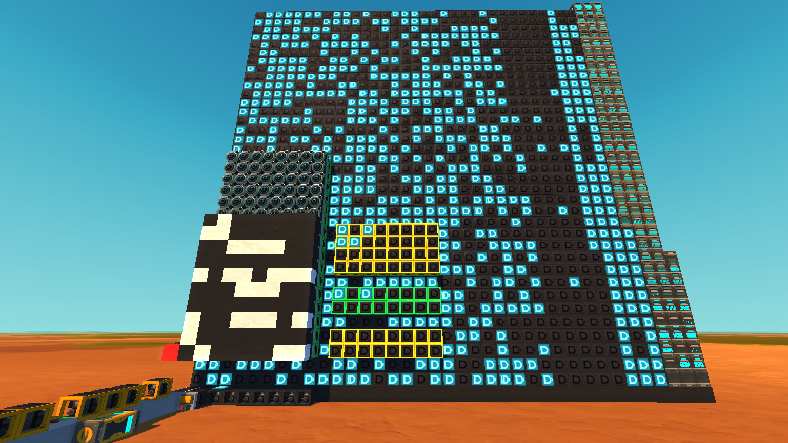
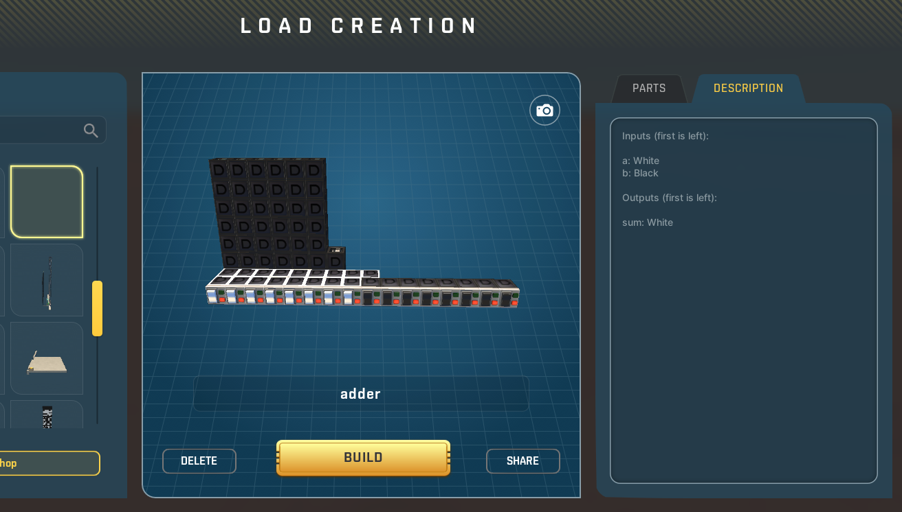
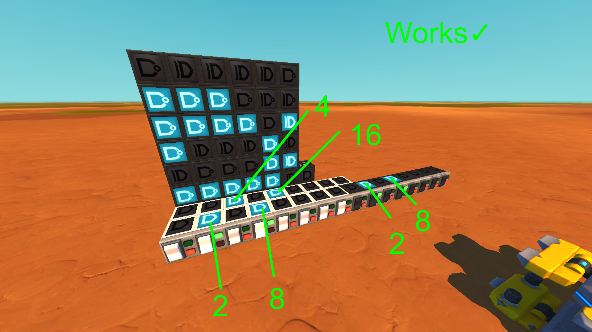
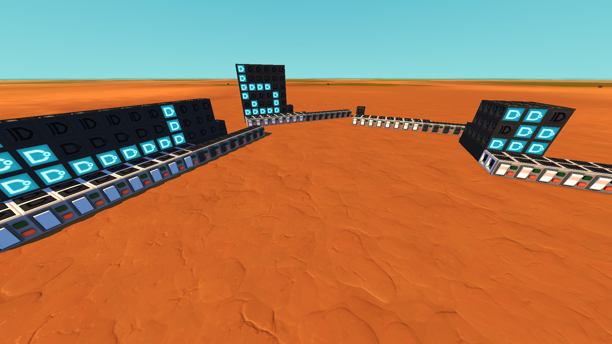
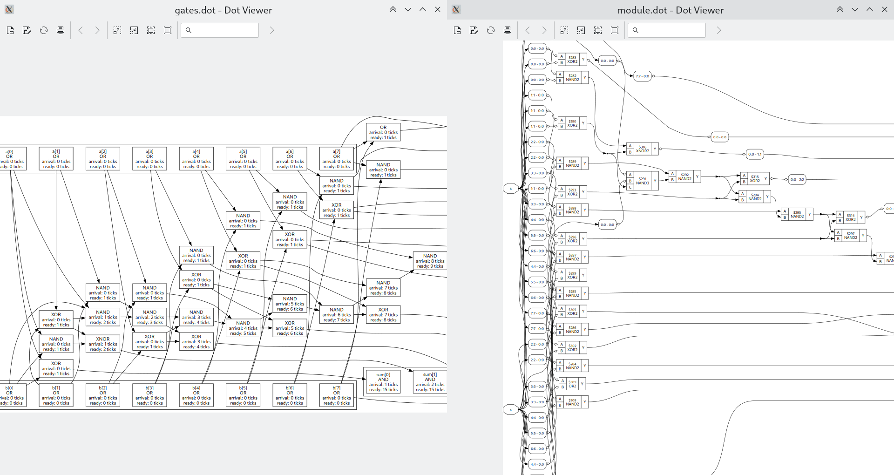

# sm-verilog

Verilog to Scrap Mechanic logic gates compiler based on [yosys](https://github.com/YosysHQ/yosys).

#### Cool examples


[`examples/cpu` on Reddit](https://www.reddit.com/r/ScrapMechanic/comments/16ezul4/simple_8bit_cpu_calculates_fibonacci_numbers/)

[`examples/rv32i_cpu` on Reddit](https://www.reddit.com/r/ScrapMechanic/comments/18xmg9p/riscv_cpu_computing_fibonacci_numbers/)

## Installation

### Requirements

* Python 3
* [yosys](https://github.com/YosysHQ/yosys)
* Graphviz (optional, needed for viewing logic flowcharts)

All scripts are meant to be run on Linux, running on other platforms may require some tweaks.

```bash
git clone https://github.com/trickybestia/sm-verilog.git

cd sm-verilog

python -m venv venv
source venv/bin/activate

pip install -r requirements.txt
```

## Usage example

Let's write 8-bit adder in Verilog and then compile it to Scrap Mechanic blueprint.

Verilog code is simple (that's the content of `examples/adder.sv`):
```sv
module adder (
    (* attachment="switch" *) // other attachment is "sensor"
    input bit [7:0] a, b,     // you also can rotate attachments
    // using attachment_rotation attribute, values are "forward"
    // and "backward" (default). You can rotate gate using
    // gate_rotation, values are "forward", "backward",
    // and "top" (default).
    
    output bit [8:0] sum
);
    always begin
        sum = a + b;
    end
endmodule
```

Go into the cloned repository and run the following command (command arguments are described later):
```bash
python -m create_blueprint --top adder --auto-height examples/adder.sv
```
The last lines of output will look like this:
```
Circuit delay is 15 ticks.

Blocks count:
        Gate: 62
        Switch: 16
        Concrete: 7

        Total: 85

Your blueprint is "blueprints/adder/9fe14476-bf17-495a-9326-d14d15172475"
```

Now you can move `blueprints/adder/9fe14476-bf17-495a-9326-d14d15172475` to directory with Scrap Mechanic blueprints (on Linux it ends with `steamapps/compatdata/387990/pfx/drive_c/users/steamuser/AppData/Roaming/Axolot Games/Scrap Mechanic/User/User_YOUR_STEAMID/Blueprints/`). After doing that you must restart the game ([there is a trick to load new blueprints in game without restart](#blueprint-reloading-without-restart)).

After that you can see "adder" blueprint in your blueprint list (it doesn't have preview).



Let's sum 10 and 10 (1010 and 1010 in binary form) using it. Notice that least significant bit is left on every port.



### Some arguments description

You can run `create_blueprint` with `--help` to see description of each argument. Let's look at some of them.

#### --top
Set top module name. Verilog programmers should be familiar with this. You can pass multiple files to compiler:
```bash
python -m create_blueprint file1 file2 file3
```

#### --height/--auto-height/--compact/--cubic
Set logic gates placement policy. You obviously can choose only one of them at a time.


Different policies from left to right: `--height 3`, `--auto-height`, `--compact`, `--cubic`.

#### --module-flowchart/--gates-flowchart
Generate flowchart. Module flowchart is placed in `blueprints/adder/module.dot`. Gates flowchart is placed in `blueprints/adder/gates.dot`.

You can view them using any Graphviz visualizer, e.g.
```
xdot blueprints/adder/module.dot
xdot blueprints/adder/gates.dot
```



### Blueprint reloading without restart

You need some blueprint which game already "sees" and which you can load. Now you go to it's directory and replace `blueprint.json` with one which is a part of new blueprint. Do not replace `description.json`!

## License

Licensed under [GNU GPLv3](COPYING) only.
